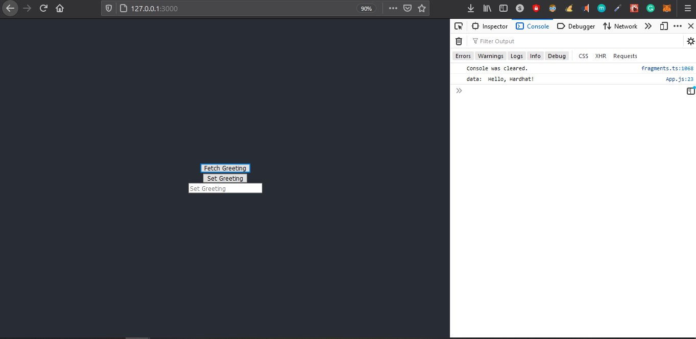
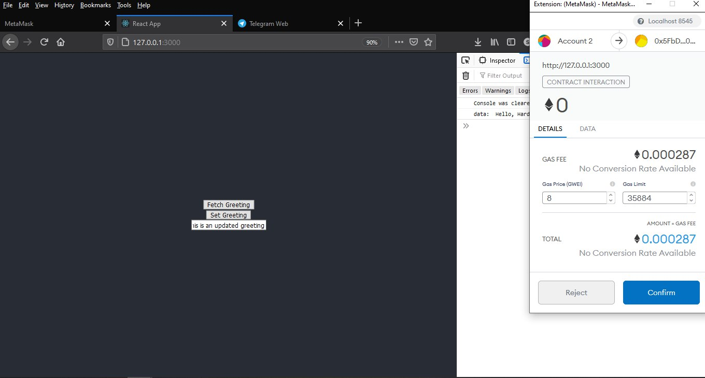
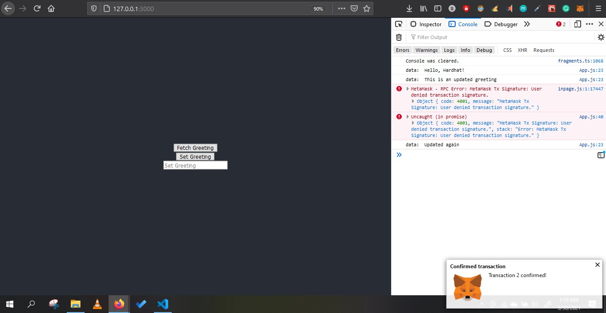
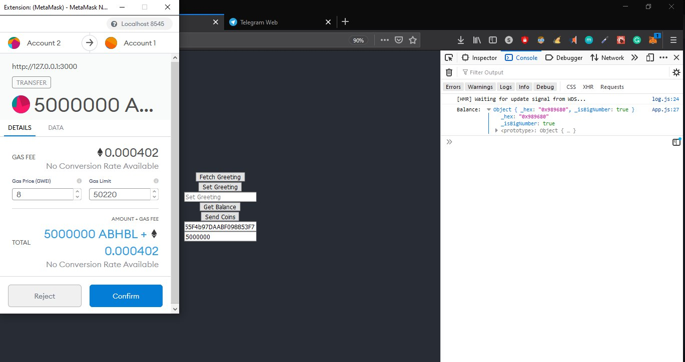
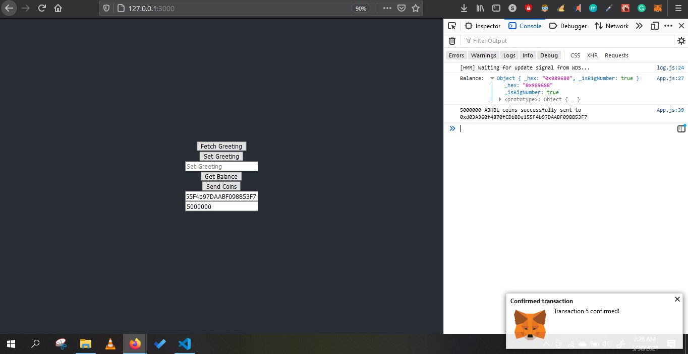

# Basic React Decentralised Application (Hardhat Development environment)

## Contract 1
The 1st contract is a simple *Greeter* contract that is deployed with an initial greeting. Once deployed, the deployed greeting can be seen (without any gas) and it can also be changed/updated which incurs some fee.

Here are some screenshots of the first contract functioning:

## Contract 2
The 2nd contract is the most basic and ofcourse unsafe implementation of a cryptocurrency. This was written for some Solidity practice and for serious projects, `openzeppelin` ERC 20 standards must be implemented. I've created a token called *Amarendra Bahubali Token* with the symbol *ABHBL* with the total supply of 1 crore tokens (1,00,00,000 ABHBL).

Here are some screenshots of the second contract functioning:

